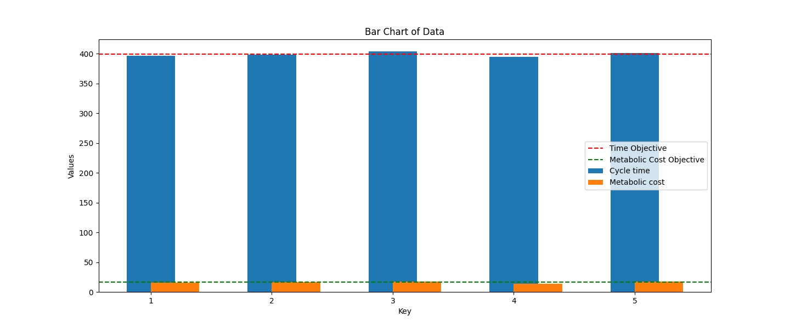

# Line Balancing Algorithm

## Overview

This project implements a line balancing algorithm to optimize task assignments to workstations while considering constraints such as cycle time and energy expenditure.

## Features

- **Precedence Constraints**: Ensures tasks are assigned in a valid sequence based on defined precedence relationships.
- **Cycle Time Optimization**: Distributes tasks across workstations to minimize cycle time while maintaining operational efficiency.
- **Metabolic Cost Optimization**: Balances tasks to minimize the metabolic cost per workstation.

## Files

- `precedencediagram.dot`: A DOT file representing the precedence constraints between tasks.
- `data.txt`: File that containts the cycle time and metabolic cost of each task. 
- `.gitignore`: Specifies files and directories to be ignored by Git.

## Usage

1. **Visualize Tasks:** Ensure the precedence diagram (precedencediagram.dot) accurately represents the production process. Use a tool like Graphviz to verify the structure.
2. **Prepare Data:** Collect and structure task data in data.txt. Include cycle times and metabolic costs:
   - Cycle time: Estimated using the MTM (Methods-Time Measurement) method.
   - Metabolic cost: Predicted using the energy expenditure equations by Garg et al. (1979).
3. **Run the Algorithm:** Execute the line balancing algorithm.

## Example

To visualize the precedence constraints, you can use graph visualization tools that support DOT files.

```
$ python main.py files/data.txt files/precedencediagram.dot 5 BOTH --threshold 0
```

 

## Contributing

Contributions are welcome! Please fork the repository and submit a pull request with your changes.

## License

This project is licensed under the MIT License.
